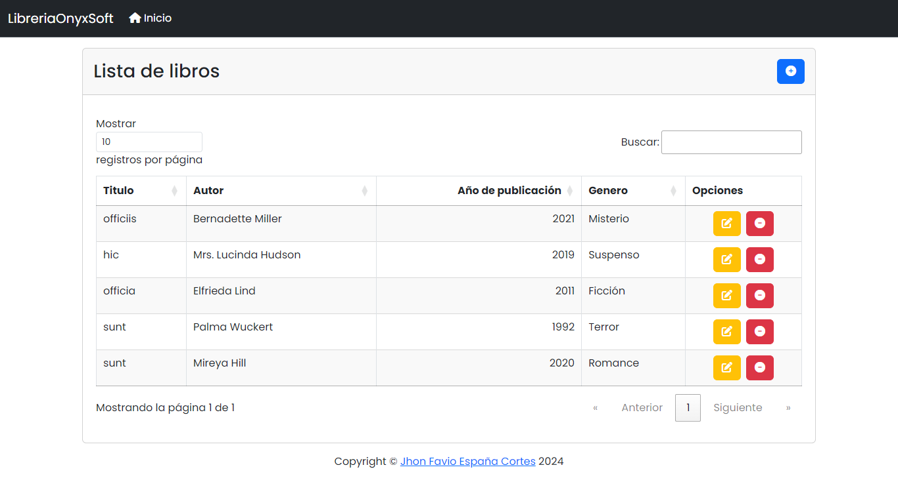

<a id="readme-top"></a>


<!-- PROJECT SHIELDS -->
[![Contributors][contributors-shield]][contributors-url]
[![Forks][forks-shield]][forks-url]
[![Stargazers][stars-shield]][stars-url]
[![Issues][issues-shield]][issues-url]
[![MIT License][license-shield]][license-url]


<!-- PROJECT LOGO -->
<br />
<div align="center">
  <a href="https://github.com/JhonFabioEC/PruebaTecnicaLibreriaOnyxSoft">
    
  </a>

  <h1 align="center">LibreriaOnyxSoft</h1>
</div>


<!-- TABLE OF CONTENTS -->
<details>
  <summary>Tabla de contenidos</summary>
  <ol>
    <li>
      <a href="#acerca-del-proyecto">Acerca del proyecto</a>
      <ul>
        <li><a href="#construido-con-🛠️">Construido con</a></li>
      </ul>
    </li>
    <li>
      <a href="#primeros-pasos-🚀">Primeros pasos</a>
      <ul>
        <li><a href="#prerrequisitos-📋">Prerrequisitos</a></li>
        <li><a href="#instalación-🔧">Instalación</a></li>
        <li><a href="#ejecución-⏯️">Ejecución</a></li>
        <li><a href="#pruebas-automáticas-🤖">Pruebas automáticas</a></li>
        <li><a href="#pruebas-con-postman-👨‍🚀">Pruebas con postman</a></li>
      </ul>
    </li>
    <li><a href="#autor-✒️">Autor</a></li>
    <li><a href="#licencia-📄">Licencia</a></li>
    <li><a href="#contactos-💬">Contactos</a></li>
  </ol>
</details>


<!-- ABOUT THE PROJECT -->
## Acerca del proyecto



<p align="right">(<a href="#readme-top">Principio de página</a>)</p>


### Construido con 🛠️

* [![HTML][HTML.com]][HTML-url]
* [![CSS][CSS.com]][CSS-url]
* [![JavaScript][JavaScript.com]][JavaScript-url]
* [![PHP][PHP.com]][PHP-url]
* [![Laravel][Laravel.com]][Laravel-url]
* [![Bootstrap][Bootstrap.com]][Bootstrap-url]
* [![JQuery][JQuery.com]][JQuery-url]

<p align="right">(<a href="#readme-top">Principio de página</a>)</p>


<!-- GETTING STARTED -->
## Primeros pasos 🚀

Sigue los pasos a continuación para configurar y ejecutar el proyecto en tu entorno local. Esto te permitirá tener una copia funcional para comenzar a trabajar rápidamente.

### Prerrequisitos 📋

Antes de comenzar, asegúrate de tener instalados los siguientes componentes y herramientas.

* Sistema Operativo: Windows (versión recomendada: 10 o superior)
* Control de Versiones: Git
* Gestor de Bases de Datos: MySQL
* Laravel

### Instalación 🔧

1. **Clona el repositorio:**
   ```sh
   git clone https://github.com/JhonFabioEC/PruebaTecnicaLibreriaOnyxSoft.git
   ```

2. **Configura el backend:**
   - Accede al directorio del backend:
     ```sh
     cd PruebaTecnicaLibreriaOnyxSoft/backend
     ```
   - Instala las dependencias:
     ```sh
     composer install
     ```
   - Crea el archivo de configuración `.env`:
     ```sh
     cp .env.example .env
     ```
   - Genera la clave de aplicación:
     ```sh
     php artisan key:generate
     ```
   - Ejecuta las migraciones y los seeders para la base de datos:
     ```sh
     php artisan migrate --seed
     ```

3. **Configura el frontend:**
   - Regresa al directorio principal y accede al directorio del frontend:
     ```sh
     cd ../frontend
     ```
   - Instala las dependencias:
     ```sh
     composer install
     ```
   - Crea el archivo de configuración `.env`:
     ```sh
     cp .env.example .env
     ```
   - Genera la clave de aplicación:
     ```sh
     php artisan key:generate
     ```

### Ejecución ⏯️

1. **Inicia el backend:**
   - Accede al directorio del backend:
     ```sh
     cd PruebaTecnicaLibreriaOnyxSoft/backend
     ```
   - Ejecuta el servidor:
     ```sh
     php artisan serve --port=8010
     ```

2. **Inicia el frontend:**
   - Accede al directorio del frontend:
     ```sh
     cd ../frontend
     ```
   - Ejecuta el servidor:
     ```sh
     php artisan serve --port=8000
     ```
   - Abre la url en el navegador:
     ```sh
     http://127.0.0.1:8000
     ```

### Pruebas automáticas 🤖

1. **Ejecuta las pruebas automáticas en el backend:**
   - Accede al directorio del backend:
     ```sh
     cd PruebaTecnicaLibreriaOnyxSoft/backend
     ```
   - Ejecuta las pruebas:
     ```sh
     php artisan test
     ```

### Pruebas con postman 👨‍🚀

Para realizar pruebas de los endpoints de la API, puedes usar Postman. A continuación se detallan algunos ejemplos de pruebas que puedes ejecutar:

1. **Listar todos los libros (GET)**
    - **Método:** `GET`
    - **Endpoint:** `http://127.0.0.1:8010/api/v1/books`
    - **Descripción:** Obtiene una lista de todos los libros disponibles en el sistema.
    - **Pasos:**
      - Abre Postman y selecciona el método `GET`.
      - Ingresa la URL: `http://127.0.0.1:8010/api/v1/books`.
      - Haz clic en Enviar para ver la respuesta, que debería incluir una lista de libros.

2. **Crear un nuevo libro (POST)**
    - **Método:** `POST`
    - **Endpoint:** `http://127.0.0.1:8010/api/v1/books`
    - **Descripción:** Crea un nuevo libro en el sistema.
    - **Cuerpo de la solicitud (Body):**
        ```json
        {
          "title": "Nuevo Libro",
          "author": "Autor Ejemplo",
          "publication_year": 2024,
          "genre": "Comedia"
        }
      ```
    - **Pasos:**
      - Abre Postman y selecciona el método `POST`.
      - Ingresa la URL: `http://127.0.0.1:8010/api/v1/books`.
      - En la pestaña `Body`, selecciona `raw` y luego elige `JSON` como formato.
      - Pega el JSON de ejemplo para crear un nuevo libro.
      - Haz clic en Enviar para ver la respuesta, que debería incluir los detalles del libro recién creado.

3. **Obtener un libro específico (GET)**
    - **Método:** `GET`
    - **Endpoint:** `http://127.0.0.1:8010/api/v1/books/{id}`
    - **Descripción:** Obtiene los detalles de un libro específico por su `id`.
    - **Pasos:**
      - Abre Postman y selecciona el método `GET`.
      - Ingresa la URL: `http://127.0.0.1:8010/api/v1/books/{id}`, reemplazando `{id}` por el ID del libro que deseas obtener.
      - Haz clic en Enviar para ver la respuesta con los detalles del libro solicitado.

4. **Actualizar un libro existente (PUT)**
    - **Método:** `PUT`
    - **Endpoint:** `http://127.0.0.1:8010/api/v1/books/{id}`
    - **Descripción:** Actualiza la información de un libro existente.
    - **Cuerpo de la solicitud (Body):**
        ```json
        {
          "title": "Cien años de soledad",
          "author": "Gabriel García Márquez",
          "publication_year": 1967,
          "genre": "Literario del Drama"
        }
      ```
    - **Pasos:**
      - Abre Postman y selecciona el método `PUT`.
      - Ingresa la URL: `http://127.0.0.1:8010/api/v1/books/{id}`, reemplazando `{id}` por el ID del libro que deseas actualizar
      - En la pestaña `Body`, selecciona `raw` y luego elige `JSON` como formato.
      - Pega el JSON con los nuevos detalles del libro.
      - Haz clic en Enviar para ver la respuesta, que debería incluir los detalles del libro actualizado.

5. **Eliminar un libro (DELETE)**
    - **Método:** `DELETE`
    - **Endpoint:** `http://127.0.0.1:8010/api/v1/books/{id}`
    - **Descripción:** Elimina un libro específico por su `id`.
    - **Pasos:**
      - Abre Postman y selecciona el método `DELETE`.
      - Ingresa la URL: `http://127.0.0.1:8010/api/v1/books/{id}`, reemplazando `{id}` por el ID del libro que deseas eliminar.
      - Haz clic en Enviar para ver la respuesta, que debería confirmar la eliminación del libro.


<p align="right">(<a href="#readme-top">Principio de página</a>)</p>


<!-- AUTHOR -->
## Autor ✒️

- **Jhon Favio España Cortes** - [JhonFabioEC](https://github.com/JhonFabioEC)

<p align="right">(<a href="#readme-top">Principio de página</a>)</p>


<!-- LICENSE -->
## Licencia 📄

Este proyecto está bajo la Licencia MIT - ve el archivo `LICENSE` para detalles.

<p align="right">(<a href="#readme-top">Principio de página</a>)</p>


<!-- CONTACTS -->
## Contactos 💬

Jhon Favio España Cortes - [@jhonydev404](https://www.linkedin.com/in/jhonydev404/) - jhonnycan212@gmail.com

<p align="right">(<a href="#readme-top">Principio de página</a>)</p>


<!-- MARKDOWN LINKS & IMAGES -->
[contributors-shield]: https://img.shields.io/github/contributors/Errol-Garcia/HeartBeats.svg?style=for-the-badge
[contributors-url]: https://github.com/JhonFabioEC/PruebaTecnicaLibreriaOnyxSoft/graphs/contributors

[forks-shield]: https://img.shields.io/github/forks/Errol-Garcia/HeartBeats.svg?style=for-the-badge
[forks-url]: https://github.com/JhonFabioEC/PruebaTecnicaLibreriaOnyxSoft/network/members

[stars-shield]: https://img.shields.io/github/stars/Errol-Garcia/HeartBeats.svg?style=for-the-badge
[stars-url]: https://github.com/JhonFabioEC/PruebaTecnicaLibreriaOnyxSoft/stargazers

[issues-shield]: https://img.shields.io/github/issues/Errol-Garcia/HeartBeats.svg?style=for-the-badge
[issues-url]: https://github.com/JhonFabioEC/PruebaTecnicaLibreriaOnyxSoft/issues

[license-shield]: https://img.shields.io/github/license/Errol-Garcia/HeartBeats.svg?style=for-the-badge
[license-url]: https://github.com/JhonFabioEC/PruebaTecnicaLibreriaOnyxSoft/blob/master/LICENSE

[HTML.com]: https://img.shields.io/badge/HTML-E34F26?style=for-the-badge&logo=html5&logoColor=white
[HTML-url]: https://html.spec.whatwg.org/

[CSS.com]: https://img.shields.io/badge/CSS-1572B6?style=for-the-badge&logo=css3&logoColor=white
[CSS-url]: https://www.w3.org/Style/CSS/

[JavaScript.com]: https://img.shields.io/badge/Javascript-F7DF1E?style=for-the-badge&logo=javascript&logoColor=white
[JavaScript-url]: https://developer.mozilla.org/en-US/docs/Web/JavaScript

[PHP.com]: https://img.shields.io/badge/PHP-474A8A?style=for-the-badge&logo=PHP&logoColor=white
[PHP-url]: https://www.php.net/manual/es/intro-whatis.php

[Laravel.com]: https://img.shields.io/badge/Laravel-F05340?style=for-the-badge&logo=Laravel&logoColor=white
[Laravel-url]: https://laravel.com/

[Bootstrap.com]: https://img.shields.io/badge/Bootstrap-563D7C?style=for-the-badge&logo=bootstrap&logoColor=white
[Bootstrap-url]: https://getbootstrap.com

[JQuery.com]: https://img.shields.io/badge/jQuery-0769AD?style=for-the-badge&logo=jquery&logoColor=white
[JQuery-url]: https://jquery.com